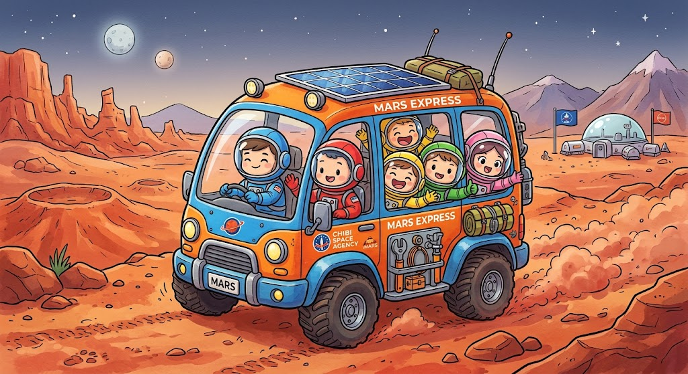

# THE MARS TRAIL - Chibi Edition

A survival adventure game set on the Red Planet!

## ☄️ About The Game
**THE MARS TRAIL - Chibi Edition (v1.1 • CHIBI DISASTER)** is a web-based strategy and survival game. Manage your crew, solve puzzles, and scavenge for resources as you attempt a grueling 2200km journey across the Martian surface.

## 🚀 Features
* **Crew Management:** Monitor the health and status of your crew members. Keep them alive!
* **Progress Tracking:** Watch your rover travel across the Martian landscape to reach the 2200km goal.
* **Scavenging:** Interactive point-and-click area to collect essential resources like ice.
* **Mirror Puzzles:** Grid-based puzzles involving sun, plant, and rock elements with interactive lighting.
* **Event Log:** Track your journey day by day (Sol by Sol) with a dynamic event log.
* **Power Grid:** Manage your systems efficiently to avoid disaster.

## 🛠️ Tech Stack
* **Frontend:** HTML5 & CSS3 (Custom variables, Grid/Flexbox layouts, Keyframe animations).
* **Logic:** JavaScript (Vanilla).
* **Fonts:** Fredoka and JetBrains Mono.

## 🎮 How to Play
1. Download or clone this repository.
2. Open `index.html` in any modern web browser.
3. Setup your crew and begin your journey!

## 📄 License
This project is open-source and available under the MIT License.

